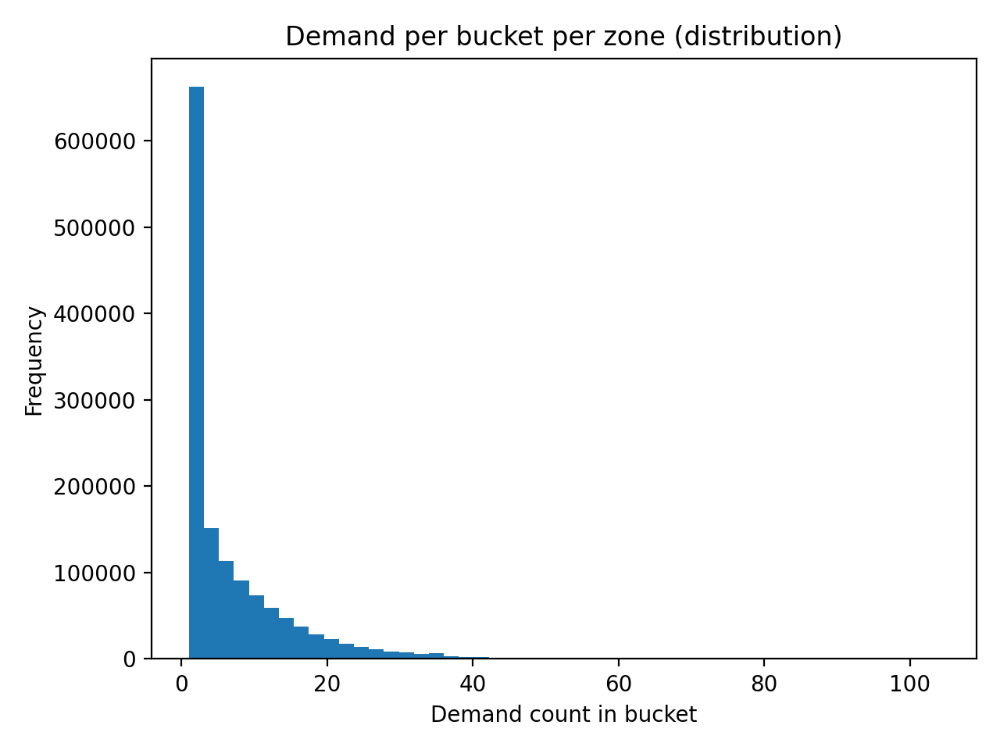
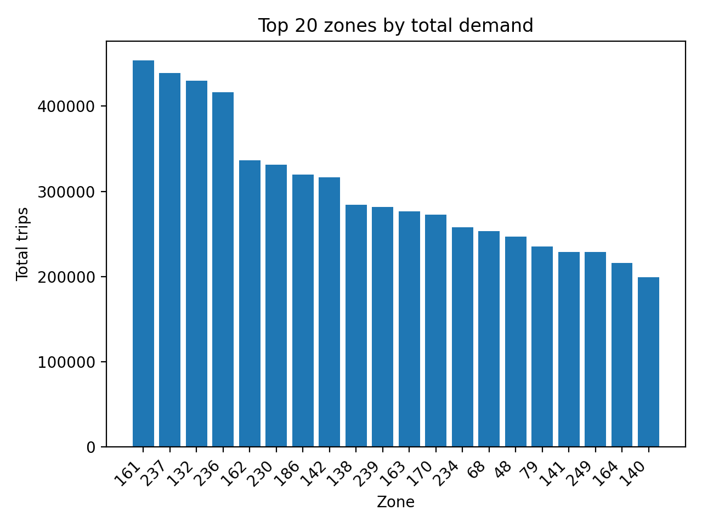
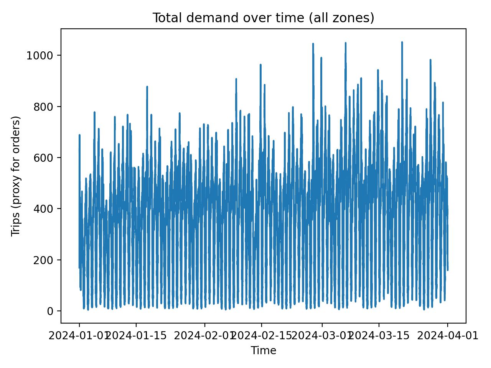
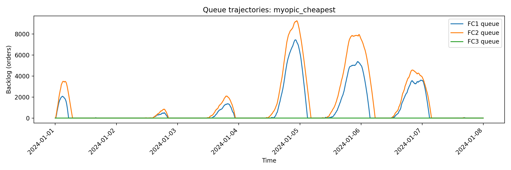
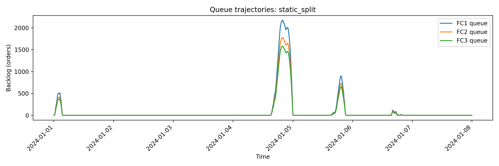
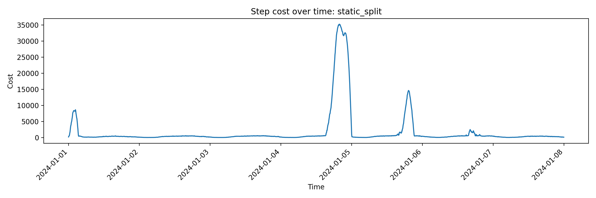
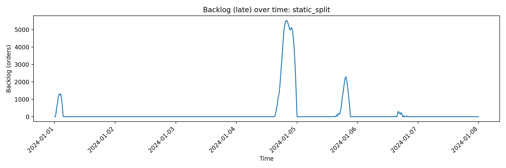
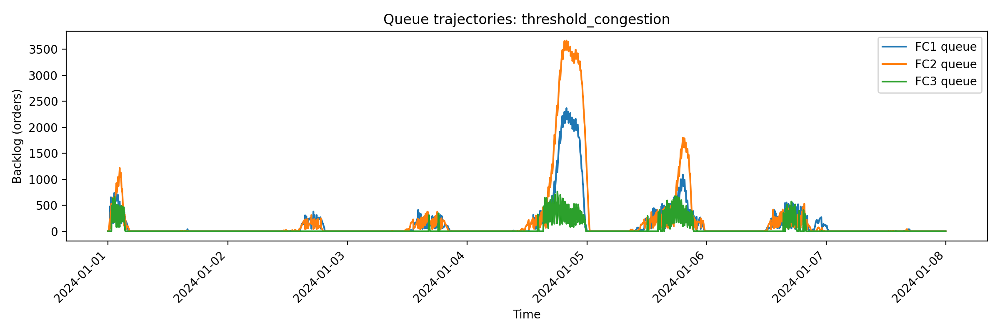
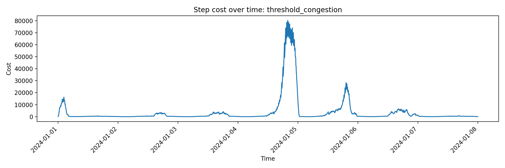

# Reinforcement Learning for Congestion-Aware Fulfillment Routing

> A reinforcement learning approach to dynamic load balancing and congestion control in fulfillment networks under real, bursty demand.

---

## 1. Problem Statement

Modern fulfillment networks operate under volatile demand, finite processing capacity, and strict service-level requirements. Orders arrive continuously across multiple customer regions, while fulfillment centers can process only a limited number of orders per time interval.

Routing policies that optimize short-term cost often ignore delayed system effects such as queue buildup and congestion persistence. These effects can cause cascading failures during demand spikes, leading to large backlogs and severe cost overruns.

This project formulates fulfillment routing as a **sequential decision-making problem** and studies whether reinforcement learning can learn **congestion-aware routing policies** that outperform static heuristics in terms of long-run cost, stability, and service performance.

---

## 2. Dataset and Demand Modeling

### 2.1 Data Source

We use New York City Taxi and Limousine Commission trip data as a proxy for customer order arrivals. Each taxi pickup is treated as an order arrival originating from a geographic zone at a specific time.

This dataset is well suited for modeling fulfillment demand because it exhibits:
- Large scale with millions of events
- Strong daily and weekly cycles
- Sudden bursts that stress capacity-constrained systems

Only pickup timestamps and pickup zones are used. No transportation behavior from the taxi system is modeled.

---

### 2.2 Time Aggregation and Zone Compression

Raw trip-level events are aggregated into fixed five-minute time buckets. For each bucket, demand is counted per pickup zone.

To control dimensionality while preserving realism:
- The top 30 highest-demand zones are retained as individual demand sources
- All remaining zones are aggregated into a single composite group labeled **OTHER**

This preserves demand concentration effects while keeping the routing problem tractable.

---

### 2.3 Exploratory Data Analysis

#### Demand Distribution per Zone and Time Bucket

Demand is highly right-skewed. Most zone–time pairs have low demand, while a small fraction experience extreme spikes. This heavy-tailed behavior is a primary driver of congestion.

---

#### Top Zones by Total Demand

A small subset of zones dominates total demand volume. This justifies focusing routing decisions on a reduced set of high-impact zones.

---

#### Total Demand Over Time

The time series shows strong periodic structure with sharp peaks. These peaks are the stress events where naive routing policies fail.

---

## 3. Fulfillment Network Simulator

We model a simplified fulfillment network with multiple fulfillment centers, each represented as a queue with finite processing capacity.

At each discrete time step:
1. New demand arrives from each zone
2. A routing policy assigns demand to fulfillment centers
3. Each center processes orders up to its capacity
4. Unprocessed orders remain in queue as backlog

Backlog represents delayed or late orders and captures congestion effects.

---

### 3.1 System Dynamics

Let:
- \( q_i(t) \) be the queue length at fulfillment center \( i \) at time \( t \)
- \( a_i(t) \) be arrivals routed to center \( i \)
- \( c_i \) be the processing capacity of center \( i \)

Queue evolution follows:

\[
q_i(t+1) = \max \left( q_i(t) + a_i(t) - c_i,\ 0 \right)
\]

This introduces temporal coupling, meaning poor routing decisions can harm system performance over many future steps.

---

## 4. Baseline Routing Policies

Before introducing reinforcement learning, we evaluate three baseline routing strategies to establish reference behavior, identify failure modes, and quantify the cost of ignoring congestion dynamics.

These baselines serve as control policies against which learning-based approaches will later be compared.

---

### 4.1 Myopic Cheapest Routing

Each demand zone routes all incoming orders to the fulfillment center with the lowest per-order shipping cost.

\[
\pi(z) = \arg\min_i \; \text{cost}_{z,i}
\]

Where:
- \( z \) denotes a demand zone
- \( i \) indexes fulfillment centers
- \( \text{cost}_{z,i} \) represents the marginal shipping or processing cost

This policy is locally optimal at each decision step but ignores system state, queue length, and future consequences.

**Observed behavior:**
- Rapid overload of the cheapest fulfillment centers
- Large and persistent queues during demand surges
- Extreme cost spikes driven by late-order penalties
- Poor recovery after congestion events due to backlog accumulation

The myopic policy consistently exhibits catastrophic failures under peak demand, making it unsuitable for realistic operations.

#### 📊 Figures
- Queue trajectories under myopic routing  
  

- Step cost over time under myopic routing  
  

- Late backlog over time under myopic routing  
  

---

### 4.2 Static Capacity-Proportional Split

Incoming demand is split across fulfillment centers in proportion to their processing capacities, independent of real-time congestion.

\[
a_i(t) = D(t) \cdot \frac{c_i}{\sum_j c_j}
\]

Where:
- \( D(t) \) is total system demand at time \( t \)
- \( c_i \) is the processing capacity of fulfillment center \( i \)

This policy enforces long-run load balance but does not adapt to short-term fluctuations.

**Observed behavior:**
- More evenly distributed queues across fulfillment centers
- Significantly reduced cost volatility compared to myopic routing
- Lower average backlog during normal demand conditions
- Inability to adapt during extreme demand spikes or sudden regime shifts

Static splitting trades responsiveness for stability and performs well only when demand patterns remain predictable.

#### 📊 Figures
- Queue trajectories under static split routing  
  

- Step cost over time under static split routing  
  

- Late backlog over time under static split routing  
  

---

### 4.3 Threshold-Based Congestion Routing

This heuristic augments cheapest-first routing by avoiding fulfillment centers whose congestion exceeds a predefined threshold.

\[
\text{Avoid } i \text{ if } \frac{q_i(t)}{c_i} > \rho_{\text{threshold}}
\]

Where:
- \( q_i(t) \) is the queue length at fulfillment center \( i \)
- \( c_i \) is its processing capacity
- \( \rho_{\text{threshold}} \) is a congestion tolerance parameter

Demand is routed to the next cheapest feasible fulfillment center when thresholds are violated.

**Observed behavior:**
- Substantial reduction in extreme backlog compared to myopic routing
- Lower cost spikes during peak demand
- Improved recovery after congestion events
- Sensitivity to threshold tuning
- Oscillatory queue behavior caused by hard switching decisions

While threshold-based routing introduces feedback, it remains a brittle rule-based approach that requires careful calibration.

#### 📊 Figures
- Queue trajectories under threshold-based routing  
  

- Step cost over time under threshold-based routing  
  

- Late backlog over time under threshold-based routing  
  

---

## 5. Key Insights from Baseline Analysis

The baseline experiments reveal several important insights:

- Congestion has memory. Once queues build up, recovery takes time even after demand drops
- Greedy, short-term optimal policies can be globally unstable
- Static heuristics trade efficiency for stability
- Hand-crafted congestion rules are brittle and hard to tune

These results motivate reinforcement learning as a principled approach to learning routing policies that optimize **long-term system behavior** rather than immediate cost.

---

## 6. Motivation for Reinforcement Learning

The fulfillment routing problem naturally fits a reinforcement learning framework:

- **State:** queue levels, capacity utilization, recent demand
- **Action:** routing decisions across fulfillment centers
- **Reward:** negative cost incorporating shipping, backlog, and congestion penalties

Reinforcement learning allows the agent to anticipate demand spikes, balance queues proactively, and minimize long-run operational cost.

---

## 7. Future Work

Next steps include:
- Wrapping the simulator as a Gym-style RL environment
- Training DQN-based agents for congestion-aware routing
- Evaluating performance against baseline heuristics
- Incorporating geographic structure using real zone coordinates and distance-based costs

Geography is intentionally introduced later to keep the core control problem interpretable.

---

## 8. Summary

This project demonstrates that fulfillment routing under real, bursty demand is a dynamic control problem with delayed consequences. Baseline heuristics expose clear failure modes and motivate reinforcement learning as a powerful tool for congestion-aware decision making in supply chain systems.
